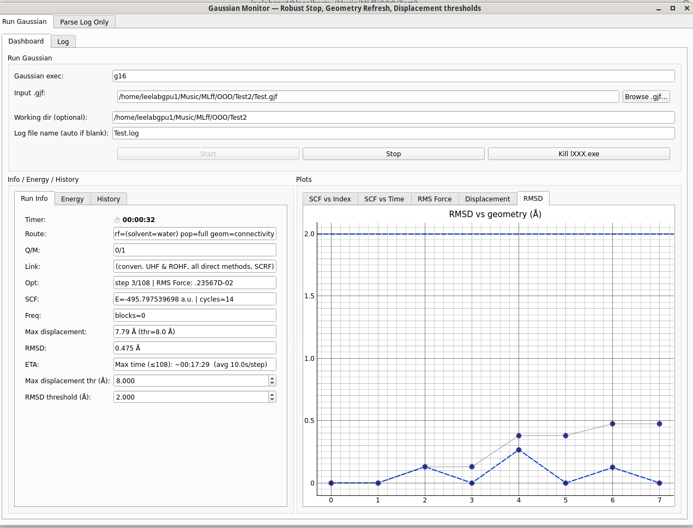

# GauMon

**GauMon** (Gaussian Live Log Monitor) is a PyQt5 desktop app for real‑time monitoring of Gaussian16 runs and post‑hoc parsing of existing log files. It plots SCF energy, RMS force, and geometry drift (RMSD and **Max displacement vs initial**) and includes alarms with user‑set thresholds.


---

## Highlights

* **Live & Offline**: Launch Gaussian from the app *or* attach to an existing `.log` and follow along as it grows.
* **Geometry metrics**:

  * **RMSD vs initial** (global drift)
  * **RMSD vs previous** (per‑step change)
  * **Max displacement vs initial** (largest single‑atom shift)
* **Thresholds UI**: Spin boxes to set alarm thresholds for **Max displacement** and **RMSD**, with dashed guide lines on plots and a flashing alert banner when exceeded.
* **Energy & history**: SCF table (with cycles), link entry history (`lXXX.exe → description`), charge/multiplicity, frequency blocks, and termination status.
* **Process control (Linux)**: Graceful stop (process group SIGTERM→SIGKILL) and an **Emergency Kill** button that force‑kills stray `lXXX.exe` sub‑processes.

---

## Layout

* **Top panel**: Job controls (Gaussian exec, input `.gjf`, working directory, log file name).
* **Left group**: Tabs for **Run Info** (timer, route, Q/M, current link, opt step, SCF line, freq blocks, Max displacement, RMSD, ETA), **Energy** (SCF table), and **History** (link entries and timestamps).
* **Right group**: Plots for SCF vs index/time, RMS Force vs step, **Max displacement**, and **RMSD** (first & previous).
* **Bottom tab**: Live log tail.

---

## Requirements

* Python **3.8+**
* Linux recommended (process management uses `os.setsid`, `killpg`, and `pkill` for `lXXX.exe`).
* Packages:

  ```bash
  pip install pyqt5 pyqtgraph numpy
  ```

> macOS/Windows: The GUI runs, but the **Kill lXXX.exe** behavior is Linux‑specific. Stopping Gaussian gracefully may also behave differently off Linux.

---

## Installation

1. Ensure Gaussian16 is installed and `g16` (or your chosen executable) is on PATH.
2. Install Python packages:

   ```bash
   pip install pyqt5 pyqtgraph numpy
   ```
3. Place `GauLogger.py` (or `GauLogger4.py`) and, optionally, `gaussian_links.json` in the same folder.

---

## Usage

### Start the GUI

```bash
python GauLogger.py
```

*(If your file is named `GauLogger4.py`, run that instead.)*

### Run Gaussian from the app (Run Gaussian tab)

1. **Gaussian exec**: e.g., `g16`.
2. **Input .gjf**: browse to your Gaussian input file.
3. **Working dir** (optional): job working folder; defaults to the `.gjf` parent.
4. **Log file name** (optional): defaults to the `.gjf` name with `.log`.
5. Click **Start**.
6. While running:

   * Watch **SCF**, **RMS Force**, **RMSD/Displacement** plots update.
   * Use **Stop** to terminate gracefully.
   * Use **Kill lXXX.exe** (Linux) to force‑kill lingering `l202.exe`, `l502.exe`, etc.

### Attach to an existing log (Parse Log Only tab)

1. Choose a `.log` (or `.out`, `.log.txt`).
2. Click **Attach**.
3. GauLogger parses the **entire file** and continues monitoring as it grows.

### Set thresholds

In **Run Info** (both tabs), adjust:

* **Max displacement thr (Å)** — red dashed line on the *Displacement* plot.
* **RMSD threshold (Å)** — blue dashed line on the *RMSD* plot.

Exceeding either threshold triggers a flashing alert banner and a text overlay on the corresponding plot.

---

## Geometry & Parsing Details

* **Coordinate table detection** uses the exact header line:

  `Number     Number       Type             X           Y           Z`

  GauLogger re‑scans the **entire log** to collect geometry blocks each cycle.

* **Max displacement vs initial**: the maximum Euclidean displacement of any single atom relative to the **first** parsed geometry (typically the initial structure). This is distinct from intra‑geometry “size/spread.”

* **RMSD vs initial**: Kabsch‑aligned RMSD between current and first geometry (same atom count/order required).

* **RMSD vs previous**: Kabsch‑aligned RMSD between consecutive geometries.

* **SCF energies** are parsed from `SCF Done:` lines, with cycle counts recorded.

* **Safety check**: If a **new energy** is appended but **no coordinates** are found in the (full) log parse, GauLogger prints an `[ERROR]` debug line to stdout to flag a potential parsing or frequency of output issue.

---

## Link Map Customization (Optional)

Create a `gaussian_links.json` file next to the app to map link numbers to descriptions:

```json
{
  "101": "Input parser & molecule setup",
  "103": "Berny geometry optimizer",
  "202": "Orientation / symmetry / stoichiometry",
  "502": "SCF/Kohn–Sham at current geometry"
}
```

These appear in the **History** table and in the **Link** field.

---

## Troubleshooting & Tips

* **Nothing plots / GUI empty**: Ensure the selected log file is correct and growing; check permissions. Try attaching to the log file after the job starts.
* **RMSD stays NaN**: The number of atoms in the incoming geometry must match the reference (first) geometry. If your job changes atom count/order mid‑run, RMSD to first won’t be defined for those steps.
* **Too many alerts**: Increase thresholds in **Run Info**.
* **Emergency cleanup**: On Linux, use **Kill lXXX.exe** to terminate orphaned Gaussian link processes.
* **Coordinate header mismatch**: GauLogger expects the `Number Number Type X Y Z` header format. If your logs differ, update the regex in `COLUMN_HEADER_RE` accordingly.

---

## Limitations

* Process control utilities are tuned for **Linux**. The GUI itself is cross‑platform, but kill semantics vary by OS.
* Kabsch alignment and displacement require consistent atom ordering between steps.
* Very large logs are re‑parsed each cycle to ensure accurate geometry detection; for multi‑GB logs on network filesystems, consider longer polling intervals or periodic archiving.

---

## Contributing

* File issues and PRs with clear descriptions and sample log snippets where applicable.
* Keep UI changes lean and cross‑platform.

### Dev quick start

```bash
python -m venv .venv
source .venv/bin/activate
pip install -U pip
pip install pyqt5 pyqtgraph numpy
python GauLogger.py
```

---

## License

MIT License © 2025 — Devashish Das
